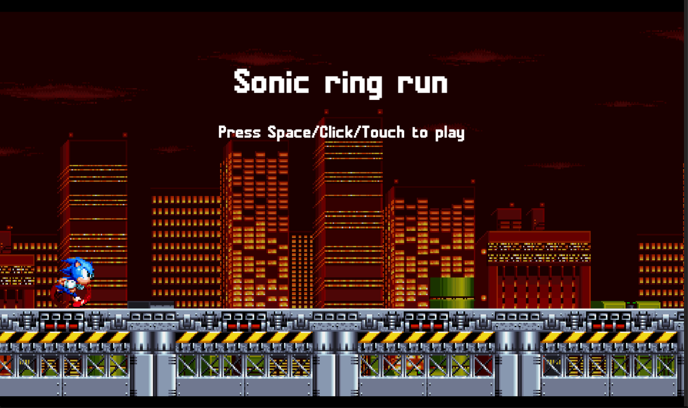

<h1 align="center">
    Sonic runner Clone - Gamedev
</h1>
<p align="center">
    
</p>

<h2 align="center">
    Click <a href="https://julianoventola.github.io/sonic-ts-indie/">here</a> to play - <b>You can play using mobile too<b>
</h2>

<p align="center">
  This repository was based on a youtube tutorial, although most of it is the same as the tutorial, I refactored the project
  to use typescript instead of just javascript, and changed some values do make it more fun
</p>

<p align="center">
<a href="#introduction">Introduction</a> &nbsp;&bull;&nbsp;
<a href="#installation">Installation</a> &nbsp;&bull;&nbsp;
<a href="#usage">Usage</a> &nbsp;&bull;&nbsp;
<a href="#technologies">Technologies</a> &nbsp;&bull;&nbsp;
<a href="#improvements">Improvements</a>
</p>

# Introduction
This <b>sonic run game clone</b> has just one level! You can:

- Use SPACE/Touch/Left clik - to jump
- The game will registed the points to put in a rank board
- Jump in more bugs gives you more points

- All sonic rights are proprietary of SEGA

## Installation

You need at least Nodejs v20+ to run the game localy

##### git/terminal
```
git clone https://github.com/julianoventola/sonic-ts-indie.git
cd sonic-ts-indie
code .
```
If you don't have vscode the "code ." won't work, just open the folder in your favorite IDE

##### Javascript
```
npm install
npm run dev
```
The game will run in http://localhost:5173/

## Usage
Play the game as much as you want! 😁

## Technologies
- This project was made base on this <a href="https://www.youtube.com/watch?v=EmMO0yQ7eeY">video</a> 
- Nodejs v20.16.0
- Typescript
- Vite
- Libraries
  - <a href="https://www.npmjs.com/package/gh-pages">gh-pages</a>


## Improvements
 - Create more levels
 - Create a special move when "X" points are earned
